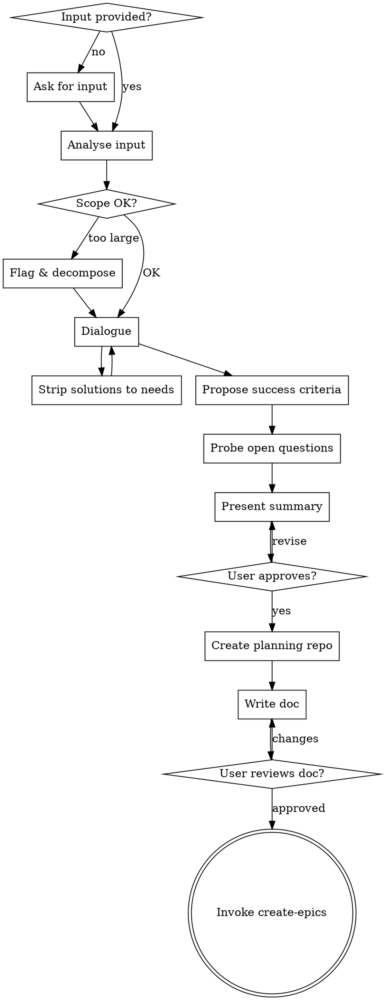

# Capture Requirements

## Purpose

Turn raw idea, initiative document, or Confluence page into stakeholder-ready requirements document through structured collaborative dialogue. Output is technology-agnostic input to create-epics.

## When to Use

- Capturing requirements from raw idea or initiative doc
- Starting new feature area from Confluence page or concept
- Before create-epics, create-issue, or implementation planning

---


<HARD-GATE>
Do NOT write the requirements doc until the dialogue is complete and the user has approved the content. Do NOT invoke any downstream skill until the user has reviewed the written doc.
</HARD-GATE>

<SOURCE-OF-TRUTH>
The planning repo must exist before writing the requirements doc. Do not write requirements into `pa.aid.conductor.ts`, a product repo, or a temporary local folder and copy them later. Repo first, then durable docs.
</SOURCE-OF-TRUTH>

---

## Input

If not provided at invocation, ask:

> "Please share the input — this can be a raw idea, a Confluence page URL, an initiative document, or a plain description."

Accept any of:
- Free-form idea description
- Confluence page URL or page ID → fetch and read the page
- Pasted document text
- Mix of the above

**Language:** Always produce the output doc in English, regardless of input language.

---

## Phase 1 — Analyse Input

Before asking any questions:

1. Read and internalize all provided input
2. Identify what is already known across the requirement themes (see Phase 2)
3. Identify technical solution details embedded in the input — flag each one during dialogue (see "Solution Stripping" below)
4. Identify scattered open questions in the input — collect them into the open questions list
5. Assess scope: if the input describes multiple independent features, flag immediately and help decompose before continuing

---

## Solution Stripping

When the input contains technical solution details (specific DB tables, API shapes, architecture choices, implementation approaches, component names), do NOT silently strip them.

Instead, surface them explicitly during dialogue:

> "This mentions [specific technical detail] — that looks like a solution choice, not a requirement. What's the underlying user need it's trying to address?"

Capture the extracted need as a requirement. Discard the solution detail from the output doc.

Exception: record genuine technical **constraints** (e.g. "must run on-premise", "must integrate with Empolis API") — these belong in the Constraints section.

---

## Phase 2 — Dialogue

Ask clarifying questions one at a time. Follow these themes, but adapt order and depth to what's already known from the input. Skip questions whose answers are already clear.

**Themes (not a fixed sequence):**

| Theme | Key questions |
|-------|---------------|
| **Problem** | What's broken or missing today? Who feels the pain? What's the cost of not solving it? |
| **Users** | Who are the target users? What role/context are they in when they need this? |
| **Goals** | What outcome do users get? What does the product gain? |
| **Requirements** | What must the system do? What must it never do? |
| **Constraints** | Hard limits: compliance, licensing, integration, performance, platform |
| **Success criteria** | How do we know it worked? (agent proposes drafts — see below) |
| **Open questions** | What's still unresolved? Who owns it? How urgent? |

**Rules:**
- One question per message
- Prefer multiple-choice questions where possible
- YAGNI: challenge scope that isn't clearly needed
- When input is ambiguous, ask — don't assume

---

## Success Criteria

Do not ask the user to provide success criteria from scratch.

Instead, after requirements are sufficiently clear, propose draft success criteria:

> "Based on what we've discussed, here are draft success criteria — do these look right, or would you adjust any of them?
> 1. [measurable criterion]
> 2. [measurable criterion]
> ..."

Iterate until user validates. Every criterion must be measurable or observable — no vague criteria like "users are happy" or "performance is acceptable".

---

## Open Questions

**During dialogue:** collect any unresolved items that surface.

**At the end of dialogue:** actively probe:

> "Before we write the doc — are there things still unclear or unresolved that we should capture? For each one, who should own it and how urgent is it?"

For each open question, capture:
- The question itself
- Owner (name or role)
- Urgency: 🔴 Blocker (must resolve before dev starts) / 🟡 Important (resolve before first release) / 🟢 Nice to know

---

## Phase 3 — Present & Approve

Before writing the doc, present a summary of what will be written:

> "Here's what I'll capture in the requirements doc — does this look right?"

Present section by section, ask for approval after each. Revise before moving on.

Sections to present:
1. Context & Motivation
2. Problem Statement
3. Target Users & Personas
4. Goals & Non-Goals
5. Requirements
6. Constraints
7. Success Criteria
8. Open Questions
9. Out of Scope

---

## Phase 4 — Create Planning Repo

After the user approves the requirements summary, create or confirm the planning repo before writing the document.

1. Derive repo name from topic: `pa.aid.<topic>` — lowercase, hyphens, no special characters.
2. Propose the repo name and stop for confirmation:
   > "I'll create/use planning repo `pa.aid.<topic>` for this initiative. Does that name work?"
3. If repo already exists, switch to it and verify it is the intended planning repo.
4. If repo does not exist, create it on the git host, clone it, initialize git, and make an initial commit.
5. Scaffold minimal source-of-truth structure:

```
opencode-config/
  skills/           ← copy from pa.aid.conductor.ts/opencode-config/pa.aid.config.md/skills/
docs/
  requirements/
  plans/
  specs/
issues/
implementation_plans/
task-completions/
done/
```

Commit: `chore: initialize planning repo`

---

## Phase 5 — Write Doc

Write `docs/requirements/YYYY-MM-DD-<topic>.md` using this template:

```markdown
# Requirements: {Feature Name}

**Date:** {YYYY-MM-DD}
**Status:** Draft
**Author:** {agent}

---

## 1. Context & Motivation

{Why this exists. Business driver. Usage evidence or customer signal. 2-4 sentences.}

---

## 2. Problem Statement

{What is broken or missing today, from the user's perspective. No solution language.}

---

## 3. Target Users & Personas

| Persona | Role | Context |
|---------|------|---------|
| {name} | {role} | {when/where they encounter this problem} |

---

## 4. Goals & Non-Goals

**Goals (outcomes, not solutions):**
- {User outcome 1}
- {Product outcome 1}

**Non-Goals (explicit exclusions):**
- {What this does NOT address}

---

## 5. Requirements

{Group by theme. Use plain language. No implementation detail.}

### {Theme 1}
- {Requirement}

### {Theme 2}
- {Requirement}

---

## 6. Constraints

{Hard limits the solution must respect.}
- {Constraint}

---

## 7. Success Criteria

{How we know it worked. Each criterion must be measurable or observable.}

1. {Criterion}
2. {Criterion}

---

## 8. Open Questions

| # | Question | Owner | Urgency |
|---|----------|-------|---------|
| 1 | {question} | {name/role} | 🔴 Blocker / 🟡 Important / 🟢 Nice to know |

---

## 9. Out of Scope

{Explicit exclusions to prevent scope creep.}
- {Exclusion}
```

After writing:
1. Commit in the planning repo: `docs: add requirements doc for {topic}`
2. Ask user to review:

> "Requirements doc written and committed to `docs/requirements/{filename}`. Please review it and let me know if you want any changes."

Wait for approval. Revise and re-commit if needed.

---

## Phase 6 — Transition

Once user approves the written doc:

> "Requirements doc approved in planning repo `pa.aid.<topic>`. Next step: invoke `create-epics` to turn these requirements into Jira epics and issues."

Invoke the `create-epics` skill.

---

## Process Flow



---

## Quality Checklist

Before writing the doc:
- [ ] Every requirement is technology-agnostic (no DB tables, APIs, component names)
- [ ] Every technical detail from input either stripped or converted to a constraint
- [ ] Success criteria are measurable/observable — no vague language
- [ ] Every open question has an owner and urgency
- [ ] Non-Goals and Out of Scope are explicit
- [ ] Scope is focused enough for a single `create-epics` run
- [ ] Planning repo exists and current working directory is that repo before writing `docs/requirements/`

---

## Common Mistakes

| Mistake | Fix |
|---------|-----|
| Leaving solution details in requirements | Strip during dialogue — flag and extract the underlying need |
| Vague success criteria ("users are happy") | Rewrite as observable: "X% of users complete Y without Z" |
| Open questions with no owner | Always assign owner before writing doc |
| Non-Goals left empty | Required — prevents scope creep discussions later |
| Proceeding without user approval of doc | Hard stop — wait for explicit approval |
| Invoking create-epics before doc approved | Doc must be reviewed and approved first |
| Writing requirements in the setup repo | Create/enter the planning repo first; it is the source of truth |
```
