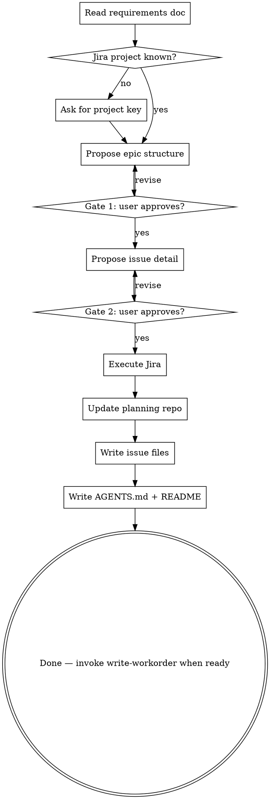

# Create Epics

## Purpose

Turn approved requirements doc into feature-driven Jira epics and stories, then write matching issue files ready for workorder. Enforces FDD: one epic = one feature, stories = vertical slices.

## When to Use

- Converting approved requirements doc into Jira epics and issues
- After capture-requirements produces requirements doc
- Before write-workorder and execution

---


## Prerequisites

1. Run from the planning repo created by `capture-requirements`
2. Approved requirements doc exists in `docs/requirements/`
3. Jira project key — provided at invocation or ask:
   > "Which Jira project should epics and issues be created in? (e.g. AS, PA, ARC)"

If no planning repo exists, stop and run `capture-requirements` to create it. Do not write planning artifacts into `pa.aid.wsl-setup.sh` or a product repo.

---

## FDD Orientation

- One epic = one user-facing feature (not a technical layer)
- Stories = vertical slices — each delivers an observable increment of the feature
- Epics are independent of each other as much as possible
- Cross-epic dependencies are explicit, minimal, documented
- Every story must be independently testable
- **Summary format:** epic = "{PROJ}: {Feature Name}" (noun phrase); story = verb phrase "[action] [result/object]" (e.g. `Display transaction history`, `Export invoice as PDF`)
- **Never use** "As a [role], I want [feature], so that [benefit]" — in summaries, descriptions, or anywhere else

---

## Phase 1 — Read Requirements

Read the requirements doc in full. Extract:

- Feature themes from section 5 (Requirements)
- Constraints from section 6
- Non-goals and out-of-scope from sections 4 and 9
- Open questions from section 8 — carry forward as-is

---

## Phase 2 — Propose Epic Structure (Gate 1)

Derive feature epics from the requirements doc. Apply FDD rule: one epic = one user-facing feature.

For each proposed epic, produce:

```
Feature name: {short user-facing name}
Proposed epic summary: {PROJECT}: {Feature name}
Rationale: {1-2 sentences — which requirements drive this epic}
Stories ({N} proposed):
  - {story summary 1}
  - {story summary 2}
  - ...
```

**Foundation epic rule:** only if 3+ epics share a genuine prerequisite (infra, auth, shared data model). Keep it small — ≤20% of total stories.

Present the full proposed structure to the user:

> "Here's the proposed epic structure derived from the requirements doc — does this look right? Feel free to rename epics, merge, split, or add/remove stories."

**STOP. Do not proceed until the user approves the epic structure.**

User may edit freely. Re-read the approved structure before Phase 3.

---

## Phase 3 — Propose Issue Detail (Gate 2)

For each approved epic, propose full issue detail for every story:

```
{EPIC-NAME} / {story-N}:
  Summary: {verb phrase — "[action] [result/object]", e.g. "Display transaction history"}
  Description: {goal + constraints, 2-3 sentences}
  Acceptance Criteria:
    1. Given {precondition}, when {action}, then {observable result}.
  In Scope:
    - {outcome bullet}
  Out of Scope:
    - {explicit exclusion}
```

Write `docs/plans/proposed-issues-{YYYY-MM-DD}.md` with all proposed issues.

Present to user:

> "Here are the proposed issues for each epic — please review. You can edit the file directly. Let me know when you're happy with the content."

**STOP. Do not proceed until the user approves the issue content.**

Re-read the approved file before Phase 4.

---

## Phase 4 — Execute Jira

Execute in this exact order:

1. **Create epics** — `atlassian_jira_create_issue(project_key, summary, issue_type="Epic")` for each approved epic
2. **Create stories** — `atlassian_jira_create_issue(project_key, summary, issue_type="Story", parent=epic_key)` for each story, with full description and AC from Phase 3
3. **Log all actions** to `docs/plans/create-epics-log-{YYYY-MM-DD}.md`:

```markdown
# Create Epics Log — {date}

## Epics Created
| Epic Key | Summary |
|----------|---------|

## Stories Created
| Story Key | Epic | Summary |
|-----------|------|---------|
```

Commit: `docs: add create-epics log`

---

## Phase 5 — Update Planning Repo

The planning repo already exists. Add missing directories only; do not recreate or move the repo.

Ensure structure:

```
docs/
  plans/
  requirements/
issues/
  {feature-name}/   ← one folder per epic
```

### Write issue files

Load the `create-issue` skill before writing any issue file. Use its template and quality checklist for every file.

For each story created in Phase 4:
- Path: `issues/{feature-name}/{KEY}-{kebab-title}.md`
- Pull content from Jira (post-creation state)
- Include frontmatter table: Type, Priority, Status, Assignee, Reporter, Created, Parent Epic

Commit: `docs: add issue files after Jira epic creation`

### Write AGENTS.md and README.md

**AGENTS.md** — agent-oriented context. Required sections:
- What this repo contains (folder table)
- Sibling repositories (if known)
- Workflow: issue → plan → execute → complete (4-step table)
- Commit message format
- Issue authoring conventions (pointer to create-issue skill)
- Execution planning documents (pointer to HOW-THIS-WORKS.md once workorder is run)
- MCP endpoints

**README.md** — human-oriented overview. Required sections:
- What is this? (1-2 paragraphs)
- Quick navigation (table: section → path → contents)
- Requirements doc (link)
- Issue scope and status
- Next steps (invoke write-workorder)

Commit: `docs: add AGENTS.md and README.md`

---

## Quality Checks

### After Phase 2 (epic proposal)
- [ ] Every requirement from section 5 of the requirements doc is covered by at least one epic
- [ ] No epic is named after a technical layer (e.g. "API layer", "Database")
- [ ] Foundation epic ≤20% of total stories (if present)
- [ ] Every epic has at least 1 proposed story

### After Phase 3 (issue detail)
- [ ] Every story has: summary, description, AC (Given/When/Then), in-scope, out-of-scope
- [ ] AC is observable black-box behavior — no internal implementation detail
- [ ] Out of Scope is explicit — not empty
- [ ] Open questions from requirements doc carried forward to relevant issues

### After Phase 4 (Jira)
- [ ] Every approved epic created in Jira
- [ ] Every approved story created and parented to correct epic
- [ ] Log written with all keys

### After Phase 5 (planning repo update)
- [ ] One folder per epic under `issues/`
- [ ] Every story has an issue file
- [ ] Requirements doc remains in `docs/requirements/`
- [ ] AGENTS.md and README.md written
- [ ] `opencode-config/skills/` exists from planning repo initialization, copied from `opencode-config/pa.aid.config.md/skills/`

---

## Common Mistakes

| Mistake | Fix |
|---------|-----|
| Epic named after technical layer | Rename to user-facing capability |
| Story AC describes internals | Rewrite as observable black-box behavior |
| Skipping Gate 1 or Gate 2 | Hard stop — user must approve before Jira writes |
| Creating Jira issues before Gate 2 approval | Gate 2 exists to prevent this — wait |
| Creating a second planning repo | Use the repo created by `capture-requirements`; stop if unsure |
| Writing issue files before Jira creation | Phase 5 pulls from Jira — execute Phase 4 first |
| Foundation epic growing large | Only genuine shared prerequisites — push feature-specific stories into their epics |
| Story summary written as user story ("As a…") | Rewrite as FDD verb phrase: "[action] [result/object]" |

---

## Process Flow



---

## Next Step

After all issue files are written:

> "Planning repo `pa.aid.<topic>` is ready. Next: invoke `write-workorder` to produce the execution plan with parallel lanes and wave-based milestones."

Do NOT invoke `write-workorder` automatically — let the user decide when to proceed.
