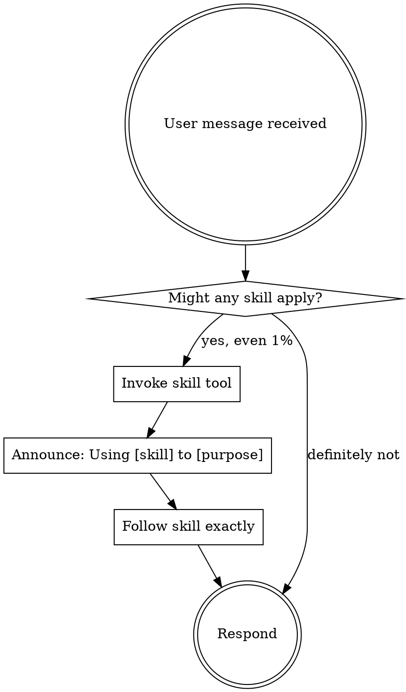

# Using Skills

## Purpose

Enforce skill discovery before any response or action. Skills encode critical decision workflows; loading the right skill first prevents misrouting and false starts.

## When to Use

- Starting any conversation or task before responding
- Clarifying which skill applies when multiple are possible
- Dispatcher/routing uncertainty
- Not for subagents executing a specific task (subagents skip this skill)

---

<SUBAGENT-STOP>
If dispatched as subagent to execute a specific task, skip this skill.
</SUBAGENT-STOP>

<EXTREMELY-IMPORTANT>
If there is even a 1% chance a skill might apply, ABSOLUTELY MUST invoke it.
IF A SKILL APPLIES, YOU DO NOT HAVE A CHOICE. YOU MUST USE IT.
Not negotiable. Not optional. Cannot rationalize out of this.
</EXTREMELY-IMPORTANT>

## Instruction Priority

1. **User's explicit instructions** (AGENTS.md, CLAUDE.md, direct requests) — highest priority
2. **Skills** — override default behavior where they conflict
3. **Default system prompt** — lowest priority

## How to Access Skills

Use the `skill` tool (OpenCode) or `Skill` tool (Claude Code). Canonical repo skills live in `/repos/pa.aid.conductor.ts/opencode-config/pa.aid.config.md/skills/`; runtime deployment copies them into `~/.config/opencode/skills/`.

## The Rule

Invoke relevant or requested skills BEFORE any response or action. Even 1% chance = invoke to check.

## Red Flags — STOP, you're rationalizing

| Thought | Reality |
|---------|---------|
| "This is just a simple question" | Questions are tasks. Check for skills. |
| "I need more context first" | Skill check comes BEFORE clarifying questions. |
| "Let me explore the codebase first" | Skills tell you HOW to explore. Check first. |
| "This doesn't need a formal skill" | If a skill exists, use it. |
| "I remember this skill" | Skills evolve. Read current version. |
| "The skill is overkill" | Simple things become complex. Use it. |
| "I'll just do this one thing first" | Check BEFORE doing anything. |

## Skill Priority

1. **Process skills first** (`write-design-spec`, `systematic-debugging`) — determine HOW to approach
2. **Workflow skills second** (write-implementation-plan, execute-implementation-plan) — guide execution

## Available Skills

| Skill | When |
|-------|------|
| `_index` | No specific skill is obvious and full registry is needed |
| `ansible-local-test` | Test ansible role changes, run ansible locally, validate playbook against Windows |
| `ansible-role-testing` | Test proALPHA Ansible roles/playbooks via RTU under `/repos` |
| `ansible-role-writing` | Write proALPHA Ansible roles/playbooks/modules with required structure, specs, tests, FQCN, idempotency |
| `apigateway` | Configure proALPHA API Gateway YARP routes, auth, CORS, rate limits, Swagger |
| `write-design-spec` | Technical design spec before implementation planning |
| `capture-requirements` | Capturing requirements from idea/doc/page |
| `caveman` | Ultra-compressed communication mode |
| `caveman-commit` | Write commit messages (/commit, "generate commit") |
| `caveman-help` | Quick-reference card for all caveman modes and commands |
| `caveman-review` | Ultra-compressed PR/code review comments |
| `close-issue` | Archiving completed issue to done/ |
| `ccoe_mod` | Select or edit CCoE Terraform reusable modules |
| `add-story-to-epic` | Adding one story to existing epic and syncing planning artifacts |
| `create-epics` | Turning planning-repo requirements into Jira epics and issues |
| `compress` | Compress memory files (CLAUDE.md, todos) into caveman format |
| `create-issue` | Writing a new engineering issue |
| `execute-implementation-plan` | Implementing an approved plan |
| `finishing-a-development-branch` | Work complete, need to merge/PR/cleanup |
| `local-code-review` | After implementation complete, before PR — runs tests, lint, type-check, reviews diff vs AC, loops fix→retest→re-review (max 3 iterations), escalates to human on failure |
| `generate-lane-runbooks` | Generate per-lane agent runbooks from a workorder |
| `openedge-guid` | Generate OpenEdge GUID / hyphenless UUID hex identifiers |
| `pa-core` | Configure Pa.Core.* .NET packages and baseapp Helm chart values |
| `platform-components` | Edit Terraform/Atmos platform component stacks and discovery tags |
| `pr-review` | Full Bitbucket PR review with Jira context and SonarQube |
| `pr-triage` | Triage today's PRs to find ones needing deeper review |
| `provisioning` | Work on SaaS provisioning, tenant onboarding, product assignment, agents, message contracts |
| `restructure-epics` | Restructure Jira epics into feature layout |
| `start-execution-session` | Starting or resuming work on a planning repo runbook |
| `systematic-debugging` | Any bug, test failure, unexpected behavior |
| `tekton-pipelines` | Create or change Tekton CI/CD pipelines and reusable tasks |
| `tekton-status` | Check live Tekton PipelineRun status via CloudWatch/EKS audit logs |
| `test-driven-development` | Any feature or bugfix implementation |
| `using-git-worktrees` | Starting feature work needing isolation |
| `write-completion-summary` | Documenting completed work |
| `write-workorder` | Issue files exist and need wave-based workorder doc |
| `write-implementation-plan` | Translating issue into execution plan |
| `writing-skills` | Creating or editing skills |

## Skill Types

**Rigid** (TDD, systematic-debugging): Follow exactly. No adaptation.
**Flexible** (`write-design-spec`, patterns): Adapt principles to context.
The skill itself states which type it is.
