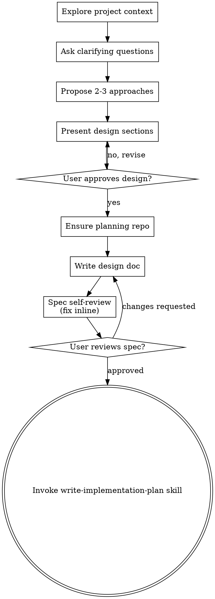

# Write Design Spec

## Purpose

Turn ideas into fully formed technical designs and specs through collaborative dialogue. Enforces design-before-implementation discipline and captures trade-offs, architecture, and approval gates.

## When to Use

- Requirements understood, technical design needed before planning
- Before write-implementation-plan
- Before any implementation or code scaffolding

---

> **Not sure which skill to use?**
> - Use `capture-requirements` when starting from a raw idea or initiative doc and the goal is a **stakeholder-readable requirements doc** (technology-agnostic, no design yet).
> - Use `write-design-spec` when requirements are already understood and the goal is a **technical design and spec** ready for implementation planning.

Help turn ideas into fully formed designs and specs through natural collaborative dialogue.

Start by understanding the current project context, then ask questions one at a time to refine the idea. Once you understand what you're building, present the design and get user approval.

<HARD-GATE>
Do NOT invoke any implementation skill, write any code, scaffold any project, or take any implementation action until you have presented a design and the user has approved it. This applies to EVERY project regardless of perceived simplicity.
</HARD-GATE>

## Anti-Pattern: "This Is Too Simple To Need A Design"

Every project goes through this process. A todo list, a single-function utility, a config change — all of them. "Simple" projects are where unexamined assumptions cause the most wasted work. The design can be short, but you MUST present it and get approval.

## Checklist

Complete these items in order:

1. **Explore project context** — check files, docs, recent commits
2. **Ask clarifying questions** — one at a time, understand purpose/constraints/success criteria
3. **Propose 2-3 approaches** — with trade-offs and your recommendation
4. **Present design** — in sections scaled to their complexity, get user approval after each section
5. **Ensure planning repo** — create or confirm the planning repo before writing durable docs
6. **Write design doc** — save to `docs/specs/YYYY-MM-DD-<topic>-design.md` in that repo and commit
7. **Spec self-review** — quick inline check for placeholders, contradictions, ambiguity, scope
8. **User reviews written spec** — ask user to review the spec file before proceeding
9. **Transition to implementation** — invoke `write-implementation-plan` skill

## Process Flow

**The terminal state is invoking `write-implementation-plan`.** Do NOT invoke any other implementation skill. The ONLY skill you invoke after `write-design-spec` is `write-implementation-plan`.

## The Process

**Understanding the idea:**

- Check out the current project state first (files, docs, recent commits)
- Assess scope: if the request describes multiple independent subsystems, flag immediately. Don't spend questions refining details of a project that needs to be decomposed first.
- If too large for a single spec, help decompose into sub-projects. Each gets its own spec → plan → implementation cycle.
- For appropriately-scoped projects, ask questions one at a time
- Prefer multiple choice questions when possible
- Only one question per message
- Focus on: purpose, constraints, success criteria

**Exploring approaches:**

- Propose 2-3 different approaches with trade-offs
- Lead with your recommended option and explain why

**Presenting the design:**

- Scale each section to its complexity
- Ask after each section whether it looks right
- Cover: architecture, components, data flow, error handling, testing

**Design for isolation and clarity:**

- Break into units with one clear purpose, well-defined interfaces, independently testable
- For each unit: what does it do, how do you use it, what does it depend on?
- Smaller, well-bounded units = easier to reason about, edit reliably

**Working in existing codebases:**

- Explore current structure before proposing changes. Follow existing patterns.
- Include targeted improvements where existing code affects the work
- Don't propose unrelated refactoring

## After the Design

**Documentation:**

- Write the validated design (spec) to `docs/specs/YYYY-MM-DD-<topic>-design.md`
- Commit the design document to git

Before writing, ensure the current working directory is the planning repo for this initiative. If no planning repo exists, create/confirm one first using the same naming convention as `capture-requirements`: `pa.aid.<topic>`. Do not write specs into `pa.aid.wsl-setup.sh` or a product repo unless that repo is explicitly the planning repo.

**Spec Self-Review:**
After writing the spec document:

1. **Placeholder scan:** Any "TBD", "TODO", incomplete sections? Fix them.
2. **Internal consistency:** Do any sections contradict each other?
3. **Scope check:** Focused enough for a single implementation plan?
4. **Ambiguity check:** Any requirement interpretable two ways? Pick one, make it explicit.

**User Review Gate:**
Ask the user to review the written spec:

> "Spec written and committed to `<path>`. Please review it and let me know if you want to make any changes before we start writing out the implementation plan."

Wait for response. Only proceed once user approves.

**Implementation:**

- Invoke the `write-implementation-plan` skill
- Do NOT invoke any other skill

## Key Principles

- **One question at a time** — don't overwhelm
- **Multiple choice preferred** — easier to answer than open-ended
- **YAGNI ruthlessly** — remove unnecessary features
- **Explore alternatives** — always propose 2-3 approaches
- **Incremental validation** — present design, get approval before moving on
